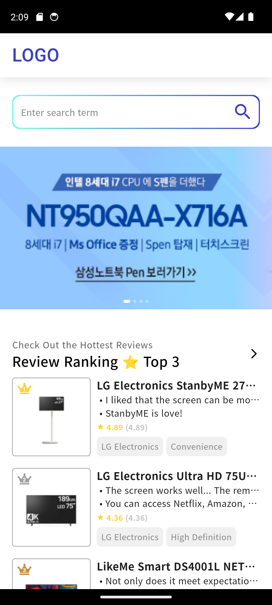
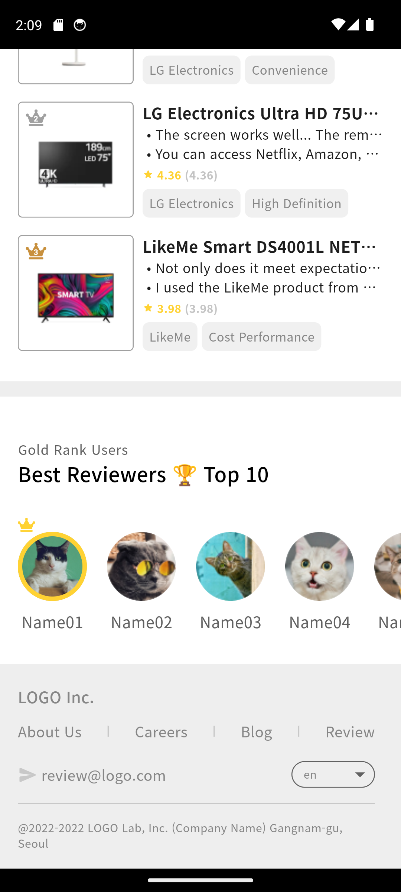

# Korean E-Shop Prototype App

This is a prototype app for a Korean e-shop, showcasing products, reviews, and user interactions. The app is built using Flutter and incorporates various packages for enhanced functionality.

## Features

- Product listings with detailed descriptions and reviews
- User reviews and ratings
- Localization (Supports English and Korean)
- Carousel slider for featured products
- Responsive UI

## Screenshots:
- Home Screen.
<p float="left">
  
  
</p>

- Reviewer Screen.
<p float="left">
  
  
</p>

## Installation

1. Clone the repository:
    ```bash
    git clone https://github.com/TGOHL/korean_shop.git
    ```
2. Navigate to the project directory:
    ```bash
    cd korean_shop
    ```
3. Install dependencies:
    ```bash
    flutter pub get
    ```
4. Run the app:
    ```bash
    flutter run
    ```

## Dependencies

The following packages are used in this project:

- [cupertino_icons: ^1.0.6](https://pub.dev/packages/cupertino_icons)
- [flutter_bloc: ^8.1.6](https://pub.dev/packages/flutter_bloc)
- [flutter_screenutil: ^5.9.3](https://pub.dev/packages/flutter_screenutil)
- [fluttertoast: ^8.2.6](https://pub.dev/packages/fluttertoast)
- [carousel_slider: ^4.2.1](https://pub.dev/packages/carousel_slider)
- [flutter_svg: ^2.0.10+1](https://pub.dev/packages/flutter_svg)
- [intl: 0.18.1](https://pub.dev/packages/intl)

## License

This project is licensed under the MIT License - see the [LICENSE](LICENSE) file for details.

## Author

Ibrahim Adel Eissa

## Acknowledgements

- Flutter community for providing extensive documentation and support.
